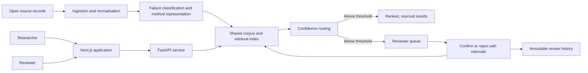
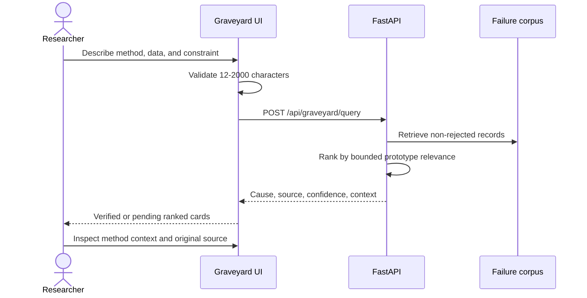
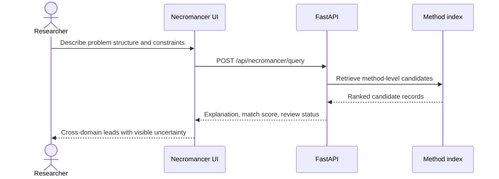
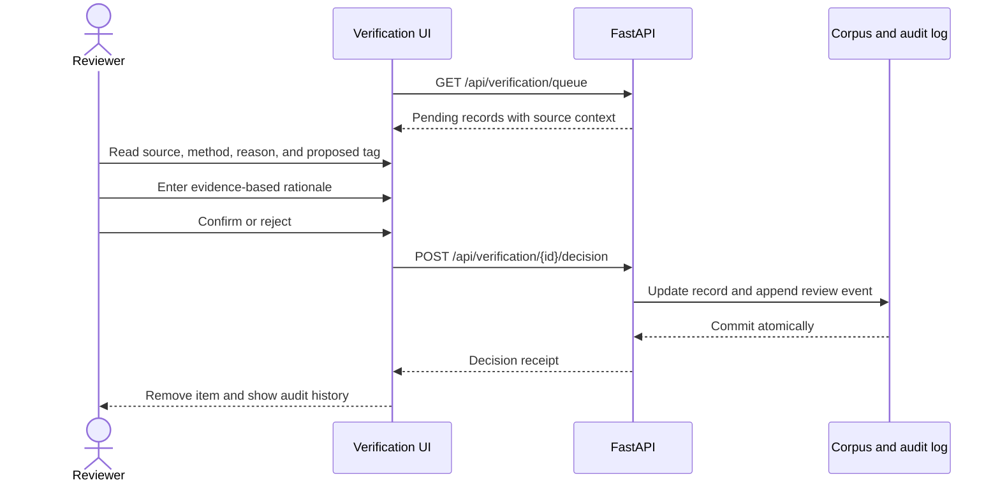

# Lazarus System Design

This document turns the proposal's four-layer architecture into an executable prototype design. It distinguishes what runs today from the production components still described as future work.

## System boundary

Lazarus is query-driven, not autonomous. A researcher initiates a Graveyard or Citation Necromancer query and remains responsible for interpreting the result. Uncertain records are visible as pending and enter the Verification Exchange for a human decision.

## Layer map

| Proposal layer | Current implementation | Production target |
|---|---|---|
| Ingestion | Deterministic three-record demonstration feed and idempotent ingestion runner | Scheduled, licensed retraction, withdrawal, and linked-repository adapters |
| Modelling | Fixed taxonomy rules; MiniLM representation with deterministic local fallback | Provider abstraction for classification/explanations and contrastively fine-tuned structural embeddings |
| Retrieval and verification | SQLite metadata, lexical prototype ranking, 0.80 confidence gate, reviewer queue, decision audit | Postgres + pgvector, structural retrieval, topical-exclusion radius, calibrated multi-signal confidence |
| Application | Next.js researcher and reviewer interfaces; FastAPI/OpenAPI contract | Authentication, roles, institutional tenancy, billing, alerts, and enterprise API controls |

## Researcher flow: Graveyard

## Researcher flow: Citation Necromancer

The current API labels its explanation as a lexical structural proxy. The proposal's contrastively fine-tuned model and topical-exclusion radius remain production work and are not misrepresented as complete.

## Reviewer flow

## Data model

- `FailureRecord` stores source provenance, method context, taxonomy output, confidence, and verification state.
- `ReviewDecision` stores an immutable decision, rationale, timestamp, and record reference.
- Rejected records remain in storage for auditability but are excluded from researcher search and the active queue.
- The prototype database is SQLite. The proposal's shared Postgres + pgvector store remains the intended deployment design.

## API contract

| Method | Route | Purpose |
|---|---|---|
| GET | `/health` | Liveness check |
| GET | `/api/status` | Corpus, verification, and bounded-coverage disclosure |
| GET | `/api/taxonomy` | Fixed failure tags and confidence threshold |
| POST | `/api/graveyard/query` | Ranked failure search |
| POST | `/api/necromancer/query` | Ranked cross-domain leads |
| GET | `/api/verification/queue` | Pending review items |
| GET | `/api/verification/history` | Immutable reviewer feedback history |
| POST | `/api/verification/{id}/decision` | Confirm or reject with required rationale |

## Trust and failure behavior

- Empty search results always retain the bounded-corpus caveat.
- Every result exposes original provenance and confidence state.
- Pending results are visually distinct from verified results.
- Query requests are normalized and bounded at both UI and API layers.
- API calls time out with an actionable message rather than leaving the interface indefinitely busy.
- A decided review item returns a conflict instead of accepting a duplicate decision.
- Production must add authentication and authorization before exposing reviewer mutation endpoints.
